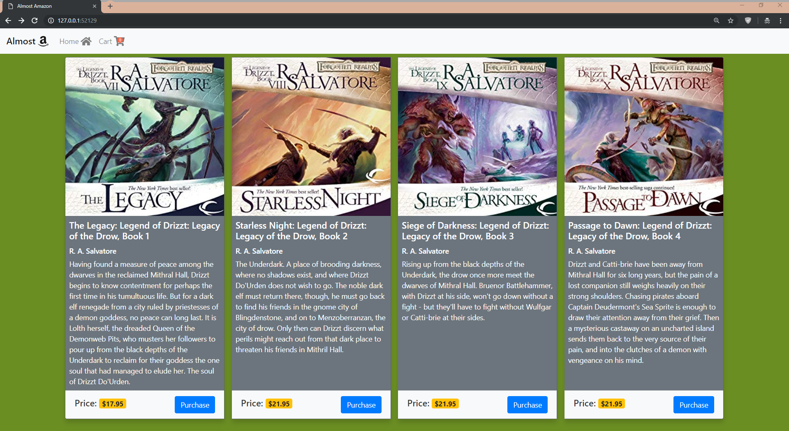
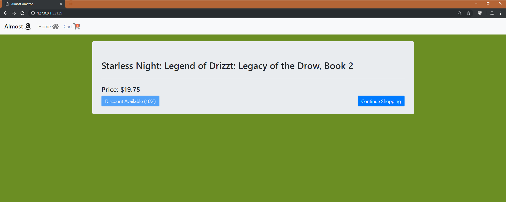

# almost-amazon

With this project we were tasked with building a bookstore leveraging ES6 Modules.

## Screenshots




## Instructions

1. A store with a single book
1. The ability to put the book in your cart

## Tech Requirements

Important to understand the way we are organizing our files. Project should have the following files

```
- javascripts/
  - main.js # the entry point to your app
  - components/
    - store.js # should hold your book object as a private variable.  Should have an event listener for the add to cart button
    - cart.js # should use a get method on the store module to get the price of the book. Should call the printToDom function and display the cart.
  - helpers/
    - util.js # should have the printToDom function.
- index.html # usual stuff with all the html and script tags
- main.css # for styling.  At minimum you should use the bootstrap grid system but feel free to style however you would like.
```

## Bonus

- Create a discount button that will discount the price of the book by some percentage. The logic for this should exist in either your util.js file or within a new module inside the helpers/ directory. The discount should only apply once to the item (meaning, I shouldn't be able to continually click the button and have the price decrease).

## How to run this project

- Use npm to install http-server in your terminal:

```sh
npm install -g http-server
```

- Run the server

```sh
hs -p 8080
```

- Open your browser and navigate to:

```
localhost:8080
```
